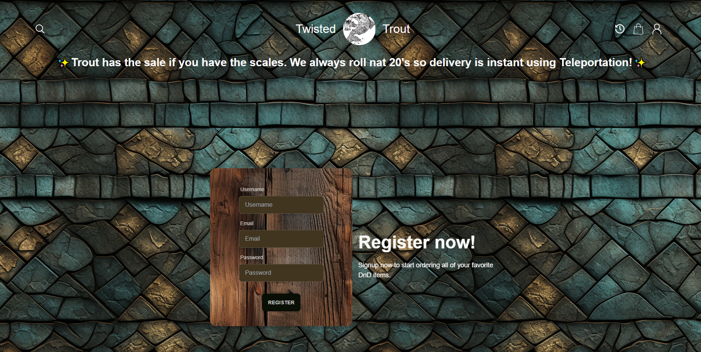
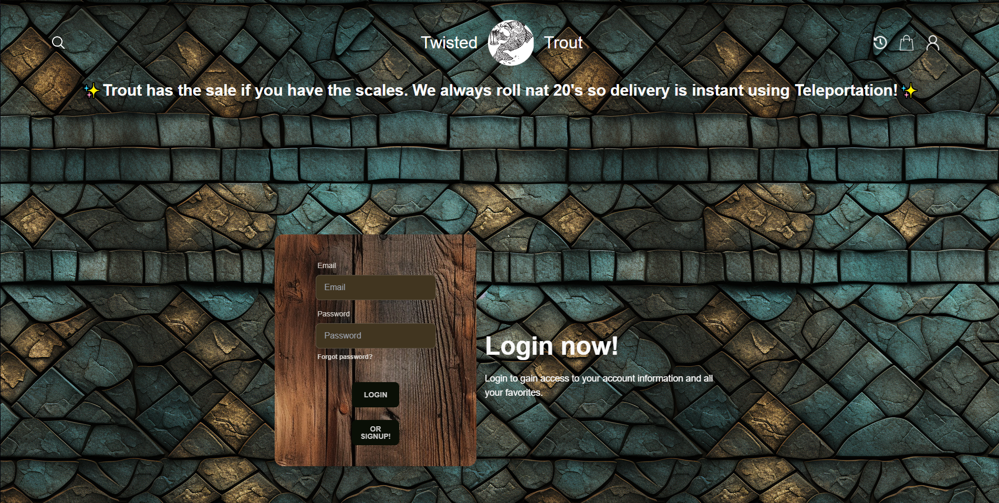
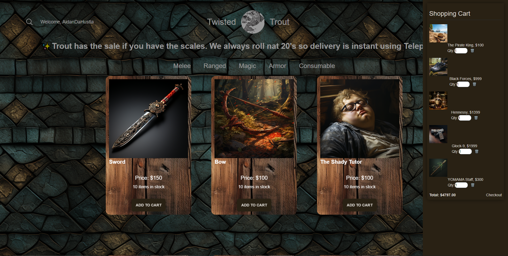
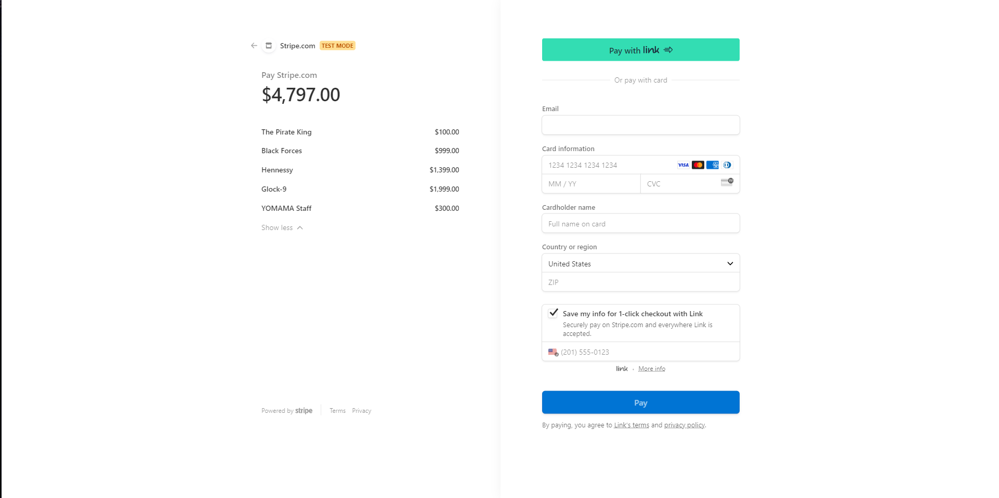
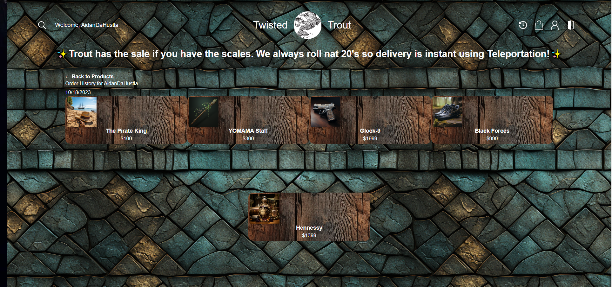

# DNDCommerce Twisted Trout
An E-commerce website designed around Dungeons and Dragons that allows users to browse and buy good to enhance their DND experience.

## Table Of Contents
- [Installation](#installation)
- [Usage](#usage)
- [License](#license)
- [How To Contribute](#how-to-contribute)
- [Tests](#tests)
- [Questions](#questions)

## Installation

To begin installation (for development) please follow the following instructions:

1. Please open the CLI(command line interface)

2. Run the command npm I to install all packages.

3. Run the command npm run seed.

4. Next run the command npm run build

5. Next run the command npm run develop

6. The react application will be running locally on your device!

## Usage

To run this DND Commerce application, please visit  https://dnd-commerce-3caad9c94c17.herokuapp.com/ .

Once there, if this is your first time, please click on the profile button (the upper right hand corner), then the fill in the form and click on the sign up button to make an account!

Once an account is made, you can enter buy items to your heart's content.  Have a blast buying!

### Screenshots

Here is a gif of our Storefront: 

Here is a screenshot of the Sign Up Page:

Here is a screenshot of the Login Page:

Here is a screenshot of the Cart Page:

Here is a screenshot of the Payment Page (Using Stripe):

Here is a screenshot of the Order History Page:

## License

License Link:
https://opensource.org/licenses/MIT

## How To Contribute
Please click [here](https://github.com/wloverde/DNDCommerce) to contribute.

## Tests
N/A

## Questions

If you have any questions, please here is our contact info:

### Emails: 
----------

Aidan Morrow: aidancmorrow1@gmail.com

Alexander Olivares: alexander.olivares1310@gmail.com

Andrew Loverde: w.andrew.loverde@gmail.com 

Frank Zhao: frank.zhao93@gmail.com

### Githubs:

-------
[Aidancm1](https://github.com/Aidancm1)

[alexanderolivares13](https://github.com/alexanderolivares13)

[woverde](https://github.com/wloverde)

[fzhao888](https://github.com/fzhao888) 